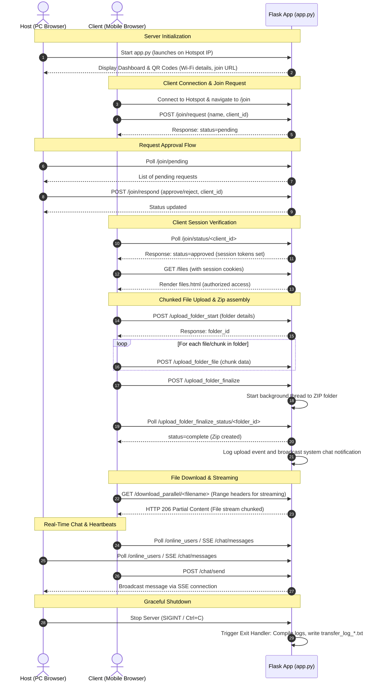

# 📁 Local File Transfer Server (LFT)

A **secure, offline-first local file transfer server** designed for high-performance file sharing over a local **Wi-Fi hotspot**. Seamlessly share massive files and folders between **PC and mobile devices** without needing an active internet connection ⚡.

> 🔒 **Fully Local** • 🚀 **Parallel Streams** • 🌐 **Zero Cloud Dependency** • 📱 **Responsive UI**

---

## 📘 Documentation & Live Demo
For the full documentation suite, APIs, setup steps, and troubleshooting guides, visit:
👉 **LFTDocs:** [https://lftdocs.netlify.app/](https://lftdocs.netlify.app/)

---

## 🎯 Key Architectural Workflows

LFT employs a strict approval-based connection flow, chunk-based upload streams, and real-time Server-Sent Events (SSE) to handle massive file transfers securely and responsively.

### 🔄 Main System Sequence Diagram

This sequence diagram illustrates the client-server connection, permissions system, and parallel upload/download routines:



---

## ✨ Features

- 🔐 **Secure Join Authorization:** Remote clients are quarantined upon connecting. The Host must manually approve or reject each user from the dashboard before files or chat can be accessed.
- 🚀 **Multi-Stream Chunked Uploads:** Upload files of any size (up to tens of gigabytes) without memory overhead. Files are divided into 5MB chunks and uploaded concurrently over parallel TCP streams.
- 📁 **Asynchronous Folder Upload & Archiving:** Upload entire folder structures recursively. The server reconstructs the folder hierarchy and compresses it into a `.zip` archive on a background thread.
- 📼 **Range Requests (HTTP 206):** Allows video and audio files to be streamed directly on connected devices, supporting scrubbing, fast-forwarding, and pausing without downloading the whole file first.
- 💬 **Real-time Collaboration & Chat:** Built-in Server-Sent Events (SSE) chat room for messaging and instant notifications when files are uploaded, renamed, or deleted.
- 📊 **Real-time SSE Transfer Metrics:** Live upload speed (MB/s), file completion percentages, active user lists, and transfer logs displayed in real time on the dashboard.
- 🗂️ **Grid & List File Explorers:** Switch between a lightweight list view and an explorer-style grid view complete with file-type matching icons, uploader tags, and download history counts.
- 💾 **Graceful Shutdown Auto-logging:** Saves full session data, download records, and chat transcripts to a timestamped log file (`transfer_log_*.txt`) upon shutdown.

---

## 🗂️ Project Structure

```bash
FILE_TRANSFER/
├── Screenshot/                  # System screenshots for user guide
│   ├── Login.png
│   ├── Server.png
│   ├── PC_Dashboard.png
│   ├── Mobile_Dashboard.jpg
│   ├── PC_Download.png
│   └── Mobile_Download.jpg
├── shared_files/                # Shared file storage directory
│   ├── .temp/                   # Temporary directory for chunk assembly
│   └── .metadata/               # JSON metadata files for uploads/downloads
├── templates/                   # Flask templates (HTML)
│   ├── chat_app.html            # Standalone real-time chat application
│   ├── dashboard.html           # Admin/Host console (QR codes, approvals, logs)
│   ├── file_arranged.html       # Windows Explorer-style grid file browser
│   ├── files.html               # Standard uploader and list view browser
│   ├── join.html                # Remote client request permission page
│   └── login.html               # Host login page
├── .env                         # Local environment variables configuration
├── .gitignore                   # Specifying ignored files (venv, logs, uploads)
├── app.py                       # Main Flask webserver, API routing & SSE manager
├── site_config.json             # Static copy of initial server settings
└── requirements.txt             # Project requirements and dependencies
```

---

## 🚀 Installation & Setup Guide

### 1. Clone the Repository
```bash
git clone https://github.com/Patel-Priyank-1602/file-transfer.git
cd file-transfer
```

### 2. Install Dependencies
Ensure you have Python 3.7+ installed. Run:
```bash
pip install -r requirements.txt
```

### 3. Configure Environment Variables
Create or edit `.env` in the root folder. Configure your hotspot settings:
```ini
# --- Hotspot Details ---
HOTSPOT_SSID=YourHotspotSSID
HOTSPOT_PASSWORD=YourHotspotPassword
HOTSPOT_IP=192.168.137.1       # Your machine's Wi-Fi hotspot gateway IP
PORT=8000

# --- Admin Credentials ---
ADMIN_USERNAME=admin
ADMIN_PASSWORD=your_secure_password

# --- App Settings ---
SECRET_KEY=generate_a_random_string_here
UPLOAD_FOLDER=shared_files
```

### 4. Locate Your Hotspot IP
To run the server, you need to bind to the IP assigned by your Wi-Fi hotspot card (usually `192.168.137.1` on Windows).
* **Windows:** Open Command Prompt and type `ipconfig`. Find the *Wireless LAN adapter Mobile Hotspot* IPv4 address.
* **Linux:** Run `ip addr show`.
* **macOS:** Check your Network Sharing preferences or run `ifconfig`.

---

## 🖥️ How to Use

### Step 1: Initialize the Server
Run the Flask server:
```bash
python app.py
```

### Step 2: Access Host Dashboard
* Navigate to `http://127.0.0.1:8000` (or `http://localhost:8000`) on the host PC.
* Log in with your admin credentials specified in `.env`.
* Keep the **Dashboard** open. This displays the QR Code for your clients to connect.

### Step 3: Client Connection
1. Scan the **Wi-Fi QR Code** on the dashboard to connect the mobile phone to the host PC's Wi-Fi network.
2. Scan the **URL QR Code** or go to `http://<HOTSPOT_IP>:8000/join`.
3. Input your display name and click **Request Access**.

### Step 4: Host Approval
* On the Host Dashboard, a notification will appear under **Pending Join Requests**.
* Click **Approve** to grant access.
* The client will automatically be redirected to the File Sharing browser.

---

## 🔒 Security Best Practices

1. **Local Scope Only:** This application is designed to run in offline networks. **Do not** expose the port to the public internet.
2. **Rotate Credentials:** Always change default credentials in the `.env` file before booting the server in public spaces.
3. **Session Expiry:** App sessions automatically close, and tokens expire on server restart to secure file metadata.

---

## 📄 License
This project is open-source and available under the MIT License.
